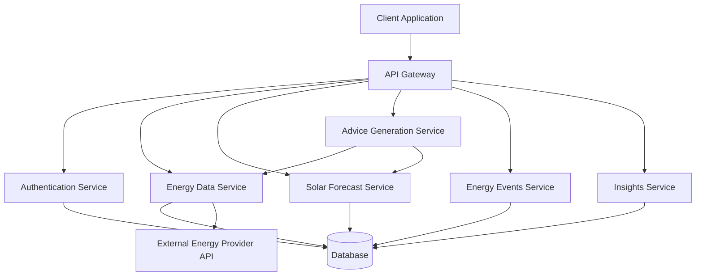

# Design Document: Energy Usage Assistant

## Overview

The Energy Usage Assistant is a mobile/web application that provides residential electricity customers with actionable advice to reduce energy costs and carbon footprint. The system architecture follows a client-server model where the client application presents energy data visualizations and recommendations, while the backend services handle data retrieval, forecasting, and advice generation.

The application integrates with external energy provider APIs to retrieve consumption data and tariff information, uses solar generation models to forecast production, and applies rule-based logic to generate personalized energy advice. The design emphasizes simplicity and educational value, avoiding complex optimization algorithms in favor of clear, understandable recommendations.

## Architecture

### System Components



### Component Responsibilities

**Client Application**
- User interface for onboarding, daily assistant, insights, and settings
- Chart rendering for 24-hour energy visualization
- Form handling for user inputs
- State management for navigation and data display

**API Gateway**
- Request routing to appropriate services
- Authentication token validation
- Rate limiting and request throttling
- Response formatting

**Authentication Service**
- User registration and login
- Energy account credential validation
- Session management
- Token generation and validation

**Energy Data Service**
- Integration with external energy provider APIs
- Retrieval of half-hourly consumption data
- Tariff structure retrieval and storage
- Data caching and synchronization

**Solar Forecast Service**
- Solar generation calculation based on system specifications
- Time-of-day and seasonal adjustments
- Weather-based forecast adjustments (future enhancement)
- 48-hour forecast generation

**Advice Generation Service**
- Analysis of consumption, generation, and pricing data
- Rule-based recommendation generation
- Prioritization of advice by impact
- EV and battery-specific advice generation

**Energy Events Service**
- Event scheduling and management
- Event notification delivery
- Participation tracking
- Performance calculation

**Insights Service**
- Consumption disaggregation using pattern recognition
- Solar performance analysis
- Household comparison calculations
- Energy personality assignment

## Components and Interfaces

### Data Models

#### User Profile
```
UserProfile {
  userId: UUID
  energyAccountId: String
  energyAccountCredentials: EncryptedString
  createdAt: Timestamp
  lastLoginAt: Timestamp
}
```

#### Solar System Configuration
```
SolarSystem {
  userId: UUID
  hasSolar: Boolean
  systemSizeKw: Float? (0.1 - 100.0, null if hasSolar = false)
  tiltDegrees: Float? (0.0 - 90.0, null if hasSolar = false)
  orientation: Enum?(N, NE, E, SE, S, SW, W, NW, null if hasSolar = false)
  updatedAt: Timestamp
}
```

#### Electric Vehicle Configuration
```
ElectricVehicle {
  vehicleId: UUID
  userId: UUID
  make: String
  model: String
  batteryCapacityKwh: Float (derived from make/model)
  chargingSpeedKw: Float (default 7.0, max 50.0)
  averageDailyMiles: Float (max 500.0)
  createdAt: Timestamp
}
```

#### Home Battery Configuration
```
HomeBattery {
  batteryId: UUID
  userId: UUID
  powerKw: Float (max 100.0)
  capacityKwh: Float (max 500.0)
  createdAt: Timestamp
}
```

#### Consumption Data Point
```
ConsumptionDataPoint {
  userId: UUID
  timestamp: Timestamp (aligned to half-hour)
  consumptionKwh: Float
  retrievedAt: Timestamp
}
```

#### Tariff Structure
```
TariffStructure {
  userId: UUID
  periods: List<TariffPeriod>
  effectiveDate: Date
}

TariffPeriod {
  name: String (e.g., "off-peak", "shoulder", "peak")
  startTime: Time
  endTime: Time
  pricePerKwh: Float
  daysOfWeek: List<DayOfWeek>
}
```

#### Solar Forecast
```
SolarForecast {
  userId: UUID
  forecastDate: Date
  intervals: List<SolarInterval>
  generatedAt: Timestamp
}

SolarInterval {
  startTime: Timestamp
  endTime: Timestamp
  generationKwh: Float
}
```

#### Energy Advice
```
EnergyAdvice {
  adviceId: UUID
  userId: UUID
  date: Date
  adviceType: Enum(GENERAL, EV_CHARGING, BATTERY_CHARGING)
  priority: Integer (1-3)
  title: String
  description: String
  recommendedTimeStart: Time
  recommendedTimeEnd: Time
  estimatedSavingsDollars: Float
}
```

#### Energy Event
```
EnergyEvent {
  eventId: UUID
  eventType: Enum(INCREASE_CONSUMPTION, DECREASE_CONSUMPTION)
  startTime: Timestamp
  endTime: Timestamp
  incentiveDescription: String
  incentiveAmountDollars: Float
  targetUserIds: List<UUID>
}

EventParticipation {
  participationId: UUID
  userId: UUID
  eventId: UUID
  baselineConsumptionKwh: Float
  actualConsumptionKwh: Float
  performanceDeltaKwh: Float
  earnedIncentiveDollars: Float
}
```

### API Interfaces

#### Authentication Endpoints

**POST /api/auth/register**
- Request: `{ email, password }`
- Response: `{ userId, token }`

**POST /api/auth/login**
- Request: `{ email, password }`
- Response: `{ userId, token }`

**POST /api/auth/link-energy-account**
- Request: `{ energyAccountId, energyAccountPassword }`
- Response: `{ success, accountLinked }`

#### Onboarding Endpoints

**POST /api/onboarding/solar-system**
- Request: `{ hasSolar: boolean, systemSizeKw?: number, tiltDegrees?: number, orientation?: string }`
- Response: `{ success, solarSystemId }`

**GET /api/onboarding/status**
- Response: `{ onboardingComplete, stepsCompleted }`

#### Daily Assistant Endpoints

**GET /api/daily-assistant/chart-data**
- Query params: `date` (today or tomorrow)
- Response:
```json
{
  "date": "2024-01-15",
  "intervals": [
    {
      "startTime": "00:00",
      "endTime": "00:30",
      "solarGenerationKwh": 0.0,
      "consumptionKwh": 0.5,
      "pricePerKwh": 0.07,
      "shading": "green"
    },
    ...
  ],
  "currentStatus": {
    "solarState": "high",
    "consumptionState": "medium",
    "currentPrice": 0.22,
    "actionPrompt": "Turn it up! Solar generation is high."
  }
}
```

**GET /api/daily-assistant/advice**
- Query params: `date`
- Response:
```json
{
  "generalAdvice": [
    {
      "title": "Run dishwasher overnight",
      "description": "Schedule for 2:00 AM to use off-peak rates",
      "estimatedSavings": 0.45
    }
  ],
  "evAdvice": [...],
  "batteryAdvice": [...]
}
```

#### Settings Endpoints

**GET /api/settings/profile**
- Response: `{ userId, energyAccountId, solarSystem, evs, batteries }`

**PUT /api/settings/solar-system**
- Request: `{ hasSolar: boolean, systemSizeKw?: number, tiltDegrees?: number, orientation?: string }`
- Response: `{ success }`

**POST /api/settings/ev**
- Request: `{ make, model, chargingSpeedKw, averageDailyMiles }`
- Response: `{ success, vehicleId }`

**DELETE /api/settings/ev/:vehicleId**
- Response: `{ success }`

**POST /api/settings/battery**
- Request: `{ powerKw, capacityKwh }`
- Response: `{ success, batteryId }`

**DELETE /api/settings/battery/:batteryId**
- Response: `{ success }`

#### Energy Insights Endpoints

**GET /api/insights/consumption-disaggregation**
- Response:
```json
{
  "categories": [
    { "name": "HVAC", "percentageOfTotal": 35, "kwhPerDay": 12.5 },
    { "name": "Water Heating", "percentageOfTotal": 20, "kwhPerDay": 7.1 }
  ],
  "evUsageDetected": true,
  "evConfigured": false
}
```

**GET /api/insights/solar-performance**
- Response:
```json
{
  "totalGenerationKwh": 450.5,
  "totalExportKwh": 180.2,
  "selfConsumptionPercentage": 60,
  "recommendations": [
    "Consider adding a battery to store excess solar"
  ]
}
```

**GET /api/insights/household-comparison**
- Response:
```json
{
  "userAverageDailyKwh": 28.5,
  "similarHouseholdAverageKwh": 32.0,
  "percentageDifference": -11,
  "energyPersonality": {
    "type": "Solar Saver",
    "description": "You maximize solar usage and minimize peak consumption",
    "icon": "sun-battery"
  },
  "eventHistory": [...]
}
```

#### Energy Events Endpoints

**GET /api/events/active**
- Query params: `date`
- Response:
```json
{
  "events": [
    {
      "eventId": "evt_123",
      "eventType": "INCREASE_CONSUMPTION",
      "startTime": "2024-01-15T11:00:00Z",
      "endTime": "2024-01-15T13:00:00Z",
      "incentiveDescription": "Earn $2 for every kWh above baseline",
      "incentiveAmount": 2.0
    }
  ]
}
```

### Solar Generation Calculation

The solar forecast service calculates generation using a simplified model:

**No Solar System:**
```
If hasSolar = false:
  generation = 0 for all intervals
```

**Base Generation Formula:**
```
generation = systemSizeKw × solarIrradiance × efficiencyFactor × orientationFactor × tiltFactor
```

**Solar Irradiance Model:**
- Uses time of day and day of year to estimate solar irradiance
- Peak irradiance occurs at solar noon
- Follows a sinusoidal curve from sunrise to sunset
- Zero generation during nighttime hours

**Efficiency Factor:**
- Base efficiency: 0.85 (accounts for inverter losses, temperature effects)
- Can be adjusted based on historical performance data

**Orientation Factor:**
- North-facing (Northern Hemisphere): 0.7
- Northeast/Northwest: 0.8
- East/West: 0.85
- Southeast/Southwest: 0.95
- South-facing: 1.0

**Tilt Factor:**
- Optimal tilt varies by latitude
- Factor = 1.0 - (|actualTilt - optimalTilt| / 90) × 0.3
- Optimal tilt approximation: latitude ± 15 degrees

**Time of Day Curve:**
```
For hour h between sunrise and sunset:
  solarAngle = (h - sunrise) / (sunset - sunrise) × π
  irradianceFactor = sin(solarAngle)
  peakIrradiance = 1000 W/m² (standard test conditions)
  actualIrradiance = peakIrradiance × irradianceFactor
```

### Advice Generation Logic

The advice generation service applies rule-based logic to create recommendations:

**Chart Shading Rules:**

1. **Green Shading (Recommended Increase):**
   - Off-peak tariff period AND (consumption < 50% of daily average)
   - Solar generation > consumption + 1 kWh
   - Energy event requesting increased consumption

2. **Yellow Shading (Avoid Increase):**
   - Peak tariff period
   - Solar generation < 0.5 kWh AND price > shoulder rate

3. **Red Shading (Energy Event):**
   - Active energy event during interval

**General Advice Priority:**

1. **High Priority (Show First):**
   - Activities during solar surplus (generation > consumption + 2 kWh)
   - Activities avoiding peak periods with high consumption
   - Energy event participation

2. **Medium Priority:**
   - Activities during off-peak periods
   - Pre-cooling/heating before peak periods

3. **Low Priority:**
   - General efficiency tips
   - Seasonal recommendations

**EV Charging Advice:**

```
Calculate required charging duration:
  dailyEnergyNeed = (averageDailyMiles / vehicleEfficiency) × batteryCapacity
  chargingHours = dailyEnergyNeed / chargingSpeedKw
  requiredIntervals = ceil(chargingHours × 2)

Find optimal charging window:
  1. Identify consecutive intervals meeting duration requirement
  2. Calculate cost for each potential window
  3. Prefer windows with:
     - Lowest total cost
     - High solar generation (if available)
     - Off-peak tariff periods
  4. Return top recommendation
```

**Battery Charging Advice:**

```
Analyze tomorrow's forecast:
  tomorrowSolarTotal = sum(tomorrow's solar generation)
  tomorrowConsumptionEstimate = average(last 7 days consumption)
  expectedSurplus = tomorrowSolarTotal - tomorrowConsumptionEstimate

If expectedSurplus > batteryCapacity × 0.8:
  Recommend: "Leave battery capacity for solar charging tomorrow"
Else if expectedSurplus < batteryCapacity × 0.3:
  Recommend: "Charge battery overnight during off-peak hours"
Else:
  Recommend: "Partially charge battery to 50% overnight"
```

### Consumption Disaggregation

The insights service uses pattern recognition to estimate device-level consumption:

**Pattern Detection:**

1. **HVAC Detection:**
   - Look for cyclic patterns with 15-30 minute duty cycles
   - Higher consumption during extreme temperature hours
   - Typically 2-5 kW per cycle

2. **Water Heater Detection:**
   - Morning and evening peaks (6-8 AM, 6-9 PM)
   - Consistent power draw of 3-4.5 kW
   - Duration of 30-60 minutes

3. **EV Charging Detection:**
   - Sustained high power draw (5-11 kW)
   - Duration of 2-8 hours
   - Typically overnight or late afternoon
   - Consistent daily or near-daily pattern

4. **Baseload:**
   - Minimum consumption during overnight hours
   - Represents always-on devices (refrigerator, electronics)

5. **Discretionary Load:**
   - Remaining consumption after accounting for above categories
   - Includes cooking, laundry, entertainment

**Disaggregation Algorithm:**
```
For each day in analysis period:
  1. Identify baseload = min(overnight consumption)
  2. Detect HVAC cycles using autocorrelation
  3. Detect water heater peaks using time-of-day patterns
  4. Detect EV charging using sustained high-power patterns
  5. Calculate discretionary = total - (baseload + HVAC + water + EV)
  6. Aggregate across all days
  7. Calculate percentages
```

### Energy Personality Assignment

Based on consumption patterns and solar utilization:

**Personality Types:**

1. **Solar Maximizer:**
   - High solar self-consumption (>70%)
   - Low peak period usage
   - Criteria: `solarSelfConsumption > 0.7 AND peakUsageRatio < 0.2`

2. **Night Owl:**
   - High off-peak consumption
   - Low peak consumption
   - Criteria: `offPeakRatio > 0.5 AND peakUsageRatio < 0.25`

3. **Peak User:**
   - High consumption during peak periods
   - Criteria: `peakUsageRatio > 0.35`

4. **Steady Consumer:**
   - Consistent consumption throughout day
   - Criteria: `consumptionVariance < threshold`

5. **Event Enthusiast:**
   - High energy event participation
   - Criteria: `eventParticipationRate > 0.7`

**Calculation:**
```
peakUsageRatio = peakConsumption / totalConsumption
offPeakRatio = offPeakConsumption / totalConsumption
solarSelfConsumption = (solarGeneration - solarExport) / solarGeneration
consumptionVariance = variance(hourlyConsumption)
eventParticipationRate = eventsParticipated / eventsOffered
```

## Correctness Properties


*A property is a characteristic or behavior that should hold true across all valid executions of a system—essentially, a formal statement about what the system should do. Properties serve as the bridge between human-readable specifications and machine-verifiable correctness guarantees.*

### Property 1: Authentication Success Links Account

*For any* valid energy account credentials, when authentication is performed, the user profile should be linked to the energy account and authentication should succeed.

**Validates: Requirements 1.2**

### Property 2: Authentication Failure Handling

*For any* invalid energy account credentials, when authentication is attempted, the system should display an error message and allow retry without crashing.

**Validates: Requirements 1.3**

### Property 3: Solar Configuration Persistence

*For any* valid solar system configuration (size, tilt, orientation), when the configuration is saved, retrieving the configuration should return the same values.

**Validates: Requirements 1.5**

### Property 4: Solar Forecast Generation Completeness

*For any* solar system configuration, when a forecast is generated, it should contain exactly 48 half-hour intervals covering a complete 24-hour period.

**Validates: Requirements 2.1, 2.2**

### Property 5: Nighttime Zero Generation

*For any* half-hour interval between sunset and sunrise, the solar generation forecast should be zero.

**Validates: Requirements 2.4**

### Property 6: No Solar System Zero Generation

*For any* user who selected "I don't have solar", all solar generation forecasts should be zero for all intervals.

**Validates: Requirements 2.2**

### Property 7: Daylight Generation Proportionality

*For any* daylight half-hour interval with a configured solar system, the solar generation forecast should be proportional to the system size, with larger systems producing proportionally more energy.

**Validates: Requirements 2.5**

### Property 8: Tariff Interval Mapping Completeness

*For any* tariff structure, when mapped to half-hour intervals, all 48 intervals in a day should have an associated electricity price.

**Validates: Requirements 3.3**

### Property 9: Price Display Unit Consistency

*For any* displayed electricity price, it should be formatted in dollars per kilowatt-hour with consistent decimal precision.

**Validates: Requirements 3.4**

### Property 10: Consumption Data Retention

*For any* user with a linked energy account, the system should maintain at least 30 days of historical consumption data.

**Validates: Requirements 4.3**

### Property 11: Chart Interval Count

*For any* selected day in the Daily Assistant, the displayed chart should contain exactly 48 half-hour intervals.

**Validates: Requirements 5.2**

### Property 12: Chart Data Overlay Completeness

*For any* displayed chart, it should include all three data series: solar generation, home consumption, and electricity price for each interval.

**Validates: Requirements 5.3**

### Property 13: Chart Shading Logic

*For any* half-hour interval, the shading should be: green if price is low or solar generation is high, yellow if price is high, or red if an energy event is active.

**Validates: Requirements 5.4, 5.5, 5.6**

### Property 14: Current Status Display Completeness

*For any* time when today is selected, the current status display should include solar generation state, consumption state, and current electricity price.

**Validates: Requirements 5.7, 18.1, 18.2, 18.3**

### Property 15: Advice Display Limit

*For any* generated advice set, the system should display at most 3 recommendations, prioritized by impact.

**Validates: Requirements 5.8, 6.6**

### Property 16: Solar Surplus Advice

*For any* half-hour interval where solar generation exceeds consumption by more than 1 kWh, the system should recommend scheduling high-energy activities during that period.

**Validates: Requirements 6.2**

### Property 17: Off-Peak Advice

*For any* off-peak tariff period, the system should recommend scheduling activities during those periods.

**Validates: Requirements 6.3**

### Property 18: Peak Avoidance Advice

*For any* peak tariff period, the system should recommend avoiding high-energy activities during those periods.

**Validates: Requirements 6.4**

### Property 19: Advice Priority Ordering

*For any* set of generated advice items, they should be ordered by potential cost savings in descending order.

**Validates: Requirements 6.5**

### Property 20: EV Battery Capacity Inference

*For any* known EV make and model combination, the system should infer a battery capacity value within the typical range for that vehicle.

**Validates: Requirements 7.3**

### Property 20: EV Configuration Persistence

*For any* valid EV configuration, when saved, retrieving the configuration should return the same vehicle details.

**Validates: Requirements 7.4**

### Property 21: EV CRUD Operations

*For any* configured EV, the system should support editing the configuration and removing the EV from the user profile.

**Validates: Requirements 7.5**

### Property 22: EV Advice Generation

*For any* user with a configured EV, when generating energy advice, the system should include at least one EV-specific charging recommendation.

**Validates: Requirements 7.6, 8.1**

### Property 23: EV Charging Duration Calculation

*For any* EV configuration with average daily mileage, battery capacity, and charging speed, the calculated charging duration should equal (mileage × energy per mile) / charging speed.

**Validates: Requirements 8.2**

### Property 24: Overnight Charging Recommendation

*For any* user with an EV, when off-peak periods are available overnight, the system should recommend overnight charging.

**Validates: Requirements 8.3**

### Property 25: Solar Charging Recommendation

*For any* day when solar generation is forecasted to exceed home consumption, the system should recommend midday EV charging.

**Validates: Requirements 8.4**

### Property 26: Charging Window Prioritization

*For any* set of potential EV charging windows, they should be ordered by total cost in ascending order.

**Validates: Requirements 8.6**

### Property 27: Battery Configuration Persistence

*For any* valid home battery configuration, when saved, retrieving the configuration should return the same specifications.

**Validates: Requirements 9.3**

### Property 28: Battery CRUD Operations

*For any* configured home battery, the system should support editing the configuration and removing the battery from the user profile.

**Validates: Requirements 9.4**

### Property 29: Battery Advice Generation

*For any* user with a configured home battery, when generating energy advice, the system should include at least one battery-specific recommendation.

**Validates: Requirements 9.5, 10.1**

### Property 30: High Solar Forecast Battery Advice

*For any* day when tomorrow's solar forecast total exceeds 80% of battery capacity, the system should recommend leaving battery capacity for solar charging.

**Validates: Requirements 10.2**

### Property 31: Low Solar Forecast Battery Advice

*For any* day when tomorrow's solar forecast total is less than 30% of battery capacity, the system should recommend overnight battery charging during off-peak periods.

**Validates: Requirements 10.3**

### Property 32: Energy Event Display

*For any* scheduled energy event, it should be displayed on the 24-hour chart with red shading during the event time range.

**Validates: Requirements 11.1**

### Property 33: Energy Event Information Completeness

*For any* displayed energy event, it should show the time range, event type (increase or decrease), and incentive details.

**Validates: Requirements 11.2**

### Property 34: Increase Event Advice Alignment

*For any* energy event requesting increased consumption, the system should recommend high-energy activities during the event window.

**Validates: Requirements 11.3**

### Property 35: Decrease Event Advice Alignment

*For any* energy event requesting decreased consumption, the system should recommend avoiding activities during the event window.

**Validates: Requirements 11.4**

### Property 36: Event Participation Tracking

*For any* energy event that occurs, the system should record participation data including baseline consumption, actual consumption, and performance delta.

**Validates: Requirements 11.5**

### Property 37: Solar Settings Modification Triggers Forecast Regeneration

*For any* modification to solar system settings, when saved, the system should regenerate solar forecasts using the new configuration.

**Validates: Requirements 12.4**

### Property 38: Navigation View Switching

*For any* navigation option selected, the system should switch to the corresponding view and update the active indicator.

**Validates: Requirements 13.3, 13.4**

### Property 39: Navigation State Persistence

*For any* navigation between sections, the system should maintain the state of each section (e.g., selected day in Daily Assistant).

**Validates: Requirements 13.5**

### Property 40: Consumption Disaggregation Completeness

*For any* user with consumption data, the disaggregation should assign all consumption to categories such that the sum of category consumptions equals total consumption.

**Validates: Requirements 14.2**

### Property 41: EV Pattern Detection Prompt

*For any* user without a configured EV, when EV usage patterns are detected in consumption data, the system should prompt the user to add EV details.

**Validates: Requirements 14.3**

### Property 42: Solar Performance Metrics Display

*For any* user with a configured solar system, the energy insights should display total generation and export levels.

**Validates: Requirements 15.2**

### Property 43: High Export Battery Suggestion

*For any* user with high solar export levels (>40% of generation) and no configured battery, the system should suggest considering a home battery.

**Validates: Requirements 15.3**

### Property 44: High Export EV Suggestion

*For any* user with high solar export levels (>40% of generation) and no configured EV, the system should suggest considering an EV for solar utilization.

**Validates: Requirements 15.4**

### Property 45: Energy Personality Assignment

*For any* user with consumption data, the system should assign exactly one energy personality based on consumption patterns.

**Validates: Requirements 16.2**

### Property 46: Energy Personality Display Completeness

*For any* assigned energy personality, the display should include both a visual representation and descriptive text.

**Validates: Requirements 16.3**

### Property 47: Event History Display Completeness

*For any* completed energy event, the history display should show the event date, time, type, and performance in kWh.

**Validates: Requirements 16.4, 16.5**

### Property 48: Input Validation Bounds

*For any* user input (solar size, tilt, orientation, EV specs, battery specs), the system should validate it against defined bounds and reject values outside those bounds.

**Validates: Requirements 17.1, 17.2, 17.3, 17.4, 17.5, 17.6, 17.7**

### Property 49: Validation Error Display

*For any* validation failure, the system should display a clear error message and prevent saving the invalid data.

**Validates: Requirements 17.8**

### Property 50: Unusual Value Warning

*For any* solar system size below 1 kW or above 50 kW, the system should display a warning suggesting the user verify the value.

**Validates: Requirements 17.9**

### Property 51: High Solar Low Consumption Prompt

*For any* time when solar generation is high and consumption is low, the system should display a prompt to increase usage.

**Validates: Requirements 18.4**

### Property 52: Peak Price Reduction Prompt

*For any* time when electricity price is at peak rates, the system should display a prompt to reduce usage.

**Validates: Requirements 18.5**

## Error Handling

### Authentication Errors

**Invalid Credentials:**
- Display user-friendly error message
- Log authentication attempt for security monitoring
- Allow unlimited retry attempts with rate limiting
- Do not reveal whether username or password was incorrect

**API Connection Failures:**
- Retry with exponential backoff (3 attempts)
- Display "Unable to connect to energy provider" message
- Offer offline mode with cached data
- Log error for monitoring

**Session Expiration:**
- Detect expired tokens on API requests
- Redirect to login with "Session expired" message
- Preserve user's current view for post-login redirect

### Data Retrieval Errors

**Missing Consumption Data:**
- Display gaps in chart with dashed lines
- Show "Data unavailable" tooltip on hover
- Continue generating advice with available data
- Log missing data periods for investigation

**Tariff Data Unavailable:**
- Use default tariff structure as fallback
- Display warning banner: "Using default rates"
- Prompt user to verify tariff information
- Retry tariff retrieval on next session

**Solar Forecast Calculation Errors:**
- Fall back to simplified generation model
- Log calculation errors with input parameters
- Display forecast with lower confidence indicator
- Continue with advice generation using available data

### Validation Errors

**Out-of-Range Values:**
- Highlight invalid field in red
- Display specific error: "Value must be between X and Y"
- Prevent form submission
- Preserve other valid field values

**Invalid Data Types:**
- Display error: "Please enter a valid number"
- Clear invalid field value
- Focus on invalid field
- Provide example of valid input

**Network Errors During Save:**
- Display "Unable to save changes" message
- Offer retry button
- Preserve user input for retry
- Log error with request details

### Chart Rendering Errors

**Insufficient Data:**
- Display partial chart with available data
- Show message: "Limited data available for this period"
- Disable unavailable features gracefully
- Continue with other app functionality

**Rendering Performance Issues:**
- Implement data point decimation for large datasets
- Use canvas rendering for better performance
- Show loading indicator during render
- Timeout and display error after 5 seconds

### Advice Generation Errors

**Insufficient Data for Advice:**
- Display message: "More data needed for personalized advice"
- Show general energy-saving tips
- Explain what data is needed
- Continue with other app features

**Calculation Errors:**
- Log error with input parameters
- Fall back to simpler advice rules
- Display available advice only
- Do not show broken or incomplete advice

## Testing Strategy

### Dual Testing Approach

The Energy Usage Assistant will employ both unit testing and property-based testing to ensure comprehensive coverage:

**Unit Tests** focus on:
- Specific examples of correct behavior (e.g., onboarding flow completion)
- Edge cases (e.g., missing consumption data, extreme solar configurations)
- Integration points (e.g., external API interactions, database operations)
- Error conditions (e.g., authentication failures, network timeouts)
- UI component rendering and user interactions

**Property-Based Tests** focus on:
- Universal properties that hold for all inputs (e.g., forecast completeness, validation bounds)
- Data transformations and calculations (e.g., solar generation formulas, charging duration)
- Business logic invariants (e.g., advice prioritization, shading logic)
- Round-trip properties (e.g., configuration save/retrieve)

### Property-Based Testing Configuration

**Testing Library:** 
- JavaScript/TypeScript: fast-check
- Python: Hypothesis
- Java: jqwik

**Test Configuration:**
- Minimum 100 iterations per property test
- Each property test must reference its design document property
- Tag format: `Feature: energy-usage-assistant, Property {number}: {property_text}`

**Example Property Test Structure:**
```javascript
// Feature: energy-usage-assistant, Property 4: Solar Forecast Generation Completeness
test('solar forecast contains exactly 48 intervals', () => {
  fc.assert(
    fc.property(
      solarSystemConfigGenerator(),
      (config) => {
        const forecast = generateSolarForecast(config);
        return forecast.intervals.length === 48;
      }
    ),
    { numRuns: 100 }
  );
});
```

### Test Data Generators

Property-based tests require generators for random valid inputs:

**Solar System Configuration Generator:**
```javascript
const solarSystemConfigGenerator = () => fc.record({
  systemSizeKw: fc.float({ min: 0.1, max: 100.0 }),
  tiltDegrees: fc.float({ min: 0.0, max: 90.0 }),
  orientation: fc.constantFrom('N', 'NE', 'E', 'SE', 'S', 'SW', 'W', 'NW')
});
```

**EV Configuration Generator:**
```javascript
const evConfigGenerator = () => fc.record({
  make: fc.constantFrom('Tesla', 'Nissan', 'Chevrolet', 'BMW'),
  model: fc.string(),
  chargingSpeedKw: fc.float({ min: 1.0, max: 50.0 }),
  averageDailyMiles: fc.float({ min: 1.0, max: 500.0 })
});
```

**Tariff Structure Generator:**
```javascript
const tariffStructureGenerator = () => fc.array(
  fc.record({
    name: fc.constantFrom('off-peak', 'shoulder', 'peak'),
    startTime: fc.integer({ min: 0, max: 23 }),
    endTime: fc.integer({ min: 0, max: 23 }),
    pricePerKwh: fc.float({ min: 0.05, max: 0.50 })
  }),
  { minLength: 1, maxLength: 5 }
);
```

**Consumption Data Generator:**
```javascript
const consumptionDataGenerator = () => fc.array(
  fc.record({
    timestamp: fc.date(),
    consumptionKwh: fc.float({ min: 0.0, max: 10.0 })
  }),
  { minLength: 48, maxLength: 48 }
);
```

### Unit Test Coverage Areas

**Onboarding Flow:**
- Test successful account linking
- Test failed authentication with invalid credentials
- Test solar configuration validation
- Test onboarding completion and navigation

**Daily Assistant:**
- Test day selection toggle
- Test chart rendering with sample data
- Test shading logic for different scenarios
- Test current status display
- Test advice display and prioritization

**Settings Management:**
- Test solar configuration editing
- Test EV addition, editing, and removal
- Test battery addition, editing, and removal
- Test validation error display

**Energy Insights:**
- Test consumption disaggregation display
- Test solar performance metrics
- Test household comparison
- Test energy personality assignment
- Test event history display

**API Integration:**
- Mock external energy provider API
- Test data retrieval and caching
- Test error handling for API failures
- Test authentication token management

### Integration Testing

**End-to-End Flows:**
- Complete onboarding flow from login to Daily Assistant
- Add EV and verify charging advice appears
- Add battery and verify battery advice appears
- Participate in energy event and verify history tracking
- Modify solar configuration and verify forecast regeneration

**Cross-Component Integration:**
- Verify advice generation uses data from multiple services
- Verify chart rendering combines solar, consumption, and tariff data
- Verify insights calculations use historical consumption data
- Verify event participation tracking updates insights

### Performance Testing

**Load Testing:**
- Test chart rendering with 48 data points
- Test advice generation with multiple assets (EV + battery)
- Test insights calculation with 30 days of data
- Test API response times under load

**Optimization Targets:**
- Chart rendering: < 100ms
- Advice generation: < 200ms
- API response time: < 500ms
- Page load time: < 2 seconds

### Security Testing

**Authentication:**
- Test password hashing and storage
- Test session token generation and validation
- Test rate limiting on login attempts
- Test secure credential storage for energy accounts

**Data Protection:**
- Test encryption of sensitive data at rest
- Test HTTPS enforcement for all API calls
- Test input sanitization to prevent injection attacks
- Test authorization checks on all endpoints

### Accessibility Testing

**WCAG 2.1 Compliance:**
- Test keyboard navigation through all features
- Test screen reader compatibility
- Test color contrast ratios for chart shading
- Test form labels and error messages
- Test focus indicators on interactive elements

### Browser and Device Testing

**Supported Platforms:**
- Desktop: Chrome, Firefox, Safari, Edge (latest 2 versions)
- Mobile: iOS Safari, Chrome Android (latest 2 versions)
- Tablet: iPad, Android tablets

**Responsive Design Testing:**
- Test chart rendering on different screen sizes
- Test navigation bar on mobile devices
- Test form inputs on touch devices
- Test readability of advice text on small screens
