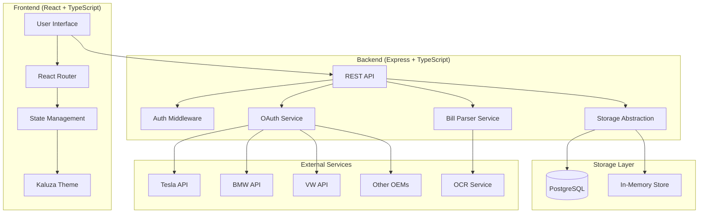

# Design Document: EV Virtual Power Plant Onboarding

## Overview

The EV VPP Onboarding application is a full-stack web application that guides residential EV owners through a multi-step enrollment process. The system consists of a React + TypeScript frontend using Kaluza branding, an Express + TypeScript backend API, and supports both PostgreSQL and in-memory storage modes.

The onboarding flow is designed to be resumable at any point, allowing users to complete the process over multiple sessions. Each step validates and persists data before advancing, ensuring data integrity and a smooth user experience.

Key design principles:
- **Resumability**: Users can stop and continue at any point
- **Security-first**: OAuth tokens encrypted, no credential storage, HTTPS-only
- **Dual-mode storage**: PostgreSQL for production, in-memory for development/testing
- **Progressive disclosure**: Information collected step-by-step to reduce cognitive load
- **Brand consistency**: Kaluza theme applied throughout the UI

## Architecture

### System Architecture



### Technology Stack

**Frontend:**
- React 18+ with TypeScript
- React Router for navigation
- Kaluza theme system (Aspekta font, nature-inspired color palette)
- Axios for API communication
- Form validation library (e.g., React Hook Form + Zod)

**Backend:**
- Node.js with Express and TypeScript
- PostgreSQL with pg library (production mode)
- In-memory data structures (development/testing mode)
- Multer for file uploads
- OAuth 2.0 client library
- Crypto module for token encryption

**External Services:**
- OCR service for bill parsing (e.g., Tesseract, AWS Textract, or Google Cloud Vision)
- EV manufacturer OAuth endpoints (Tesla, BMW, VW, etc.)

### Deployment Modes

The system supports two storage modes controlled by environment configuration:

1. **PostgreSQL Mode** (Production):
   - All data persisted to PostgreSQL database
   - Supports multiple concurrent users
   - Data survives server restarts
   - Requires database connection configuration

2. **In-Memory Mode** (Development/Testing):
   - Data stored in JavaScript Map/Object structures
   - Fast startup, no database setup required
   - Data cleared on server restart
   - Ideal for local development and automated testing

## Components and Interfaces

### Frontend Components

#### 1. OnboardingFlow Component
Main orchestrator component that manages the multi-step flow.

```typescript
interface OnboardingFlowProps {
  userId: string;
  initialStep?: OnboardingStep;
}

enum OnboardingStep {
  Landing = 'landing',
  SignupOverview = 'signup-overview',
  EmailCapture = 'email-capture',
  BillUpload = 'bill-upload',
  BillProcessing = 'bill-processing',
  AddressConsent = 'address-consent',
  TariffConfirmation = 'tariff-confirmation',
  ChargingPreferences = 'charging-preferences',
  ManufacturerSelection = 'manufacturer-selection',
  OEMAuthorization = 'oem-authorization',
  AuthorizationReturn = 'authorization-return',
  Activated = 'activated'
}
```

#### 2. Step Components
Each onboarding step is a separate component:

- **LandingPage**: Marketing content with CTA
- **SignupOverview**: Checklist and time estimate
- **EmailCapture**: Email input and verification
- **BillUpload**: File upload with drag-and-drop
- **BillProcessing**: Loading state with progress indicator
- **AddressConsent**: Address form with consent checkbox
- **TariffConfirmation**: Tariff details display and edit
- **ChargingPreferences**: Time picker, SoC slider, mode selector
- **ManufacturerSelection**: Grid of manufacturer logos with search
- **OEMAuthorization**: Redirect handler and loading state
- **AuthorizationReturn**: OAuth callback handler
- **ActivatedVehicle**: Success confirmation with summary

#### 3. Shared UI Components

```typescript
// Progress indicator
interface ProgressIndicatorProps {
  currentStep: OnboardingStep;
  completedSteps: OnboardingStep[];
}

// Form input with validation
interface ValidatedInputProps {
  label: string;
  value: string;
  onChange: (value: string) => void;
  validation: ValidationRule[];
  error?: string;
}

// File uploader
interface FileUploaderProps {
  accept: string[];
  maxSizeMB: number;
  onUpload: (file: File) => Promise<void>;
}

// Manufacturer card
interface ManufacturerCardProps {
  name: string;
  logo: string;
  onClick: () => void;
}
```

### Backend API Endpoints

#### User Management
```typescript
POST /api/users
  Body: { email: string }
  Response: { userId: string, verificationSent: boolean }

POST /api/users/:userId/verify
  Body: { code: string }
  Response: { token: string, userId: string }

GET /api/users/:userId/progress
  Response: { currentStep: OnboardingStep, completedSteps: OnboardingStep[], data: OnboardingData }
```

#### Bill Processing
```typescript
POST /api/users/:userId/bill
  Body: FormData with file
  Response: { billId: string, status: 'processing' }

GET /api/users/:userId/bill/:billId
  Response: { status: 'processing' | 'success' | 'failed', tariff?: TariffData }

POST /api/users/:userId/tariff
  Body: TariffData (manual entry)
  Response: { success: boolean }
```

#### Address and Consent
```typescript
POST /api/users/:userId/address
  Body: { address: string, postcode: string, country: string }
  Response: { success: boolean }

POST /api/users/:userId/consent
  Body: { consentGranted: boolean, timestamp: string }
  Response: { success: boolean }
```

#### Tariff Confirmation
```typescript
GET /api/users/:userId/tariff
  Response: TariffData

PUT /api/users/:userId/tariff
  Body: TariffData
  Response: { success: boolean }
```

#### Charging Preferences
```typescript
POST /api/users/:userId/preferences
  Body: ChargingPreferences
  Response: { success: boolean }

GET /api/users/:userId/preferences
  Response: ChargingPreferences
```

#### Manufacturer and Authorization
```typescript
GET /api/manufacturers
  Response: { manufacturers: Manufacturer[] }

POST /api/users/:userId/manufacturer
  Body: { manufacturerId: string }
  Response: { success: boolean }

GET /api/oauth/:manufacturer/authorize
  Query: { userId: string }
  Response: Redirect to OEM authorization page

GET /api/oauth/callback
  Query: { code: string, state: string }
  Response: Redirect to frontend with success/failure
```

#### Activation
```typescript
POST /api/users/:userId/activate
  Response: { success: boolean, vehicleStatus: 'ACTIVE' }

GET /api/users/:userId/summary
  Response: OnboardingSummary
```

### Backend Services

#### 1. Storage Service

```typescript
interface StorageService {
  // User operations
  createUser(email: string): Promise<User>;
  getUser(userId: string): Promise<User | null>;
  updateUser(userId: string, data: Partial<User>): Promise<User>;
  
  // Progress tracking
  getProgress(userId: string): Promise<OnboardingProgress>;
  updateProgress(userId: string, step: OnboardingStep, data: any): Promise<void>;
  
  // Tariff operations
  saveTariff(userId: string, tariff: TariffData): Promise<void>;
  getTariff(userId: string): Promise<TariffData | null>;
  
  // Preferences operations
  savePreferences(userId: string, prefs: ChargingPreferences): Promise<void>;
  getPreferences(userId: string): Promise<ChargingPreferences | null>;
  
  // Authorization operations
  saveAuthorization(userId: string, auth: AuthorizationData): Promise<void>;
  getAuthorization(userId: string): Promise<AuthorizationData | null>;
}

// PostgreSQL implementation
class PostgresStorageService implements StorageService {
  // Uses pg library to interact with PostgreSQL
}

// In-memory implementation
class InMemoryStorageService implements StorageService {
  // Uses Map<string, any> for data storage
}
```

#### 2. Bill Parser Service

```typescript
interface BillParserService {
  parseBill(file: Buffer, mimeType: string): Promise<BillParseResult>;
}

interface BillParseResult {
  success: boolean;
  tariff?: TariffData;
  error?: string;
}

class OCRBillParser implements BillParserService {
  async parseBill(file: Buffer, mimeType: string): Promise<BillParseResult> {
    // 1. Convert PDF/image to text using OCR
    // 2. Extract supplier name using pattern matching
    // 3. Extract tariff name using pattern matching
    // 4. Identify rate structure (flat vs TOU)
    // 5. Extract rate periods and prices
    // 6. Return structured tariff data
  }
}
```

**Bill Parsing Strategy:**
- Use OCR service to extract text from uploaded files
- Apply regex patterns to identify key fields (supplier, tariff name, rates)
- For TOU tariffs, look for time ranges and associated prices
- For flat tariffs, extract single price per kWh
- Return confidence scores for extracted data
- Fall back to manual entry if confidence is low

#### 3. OAuth Service

```typescript
interface OAuthService {
  getAuthorizationUrl(manufacturer: string, userId: string): string;
  handleCallback(code: string, state: string): Promise<AuthorizationResult>;
  refreshToken(userId: string): Promise<string>;
}

interface AuthorizationResult {
  success: boolean;
  userId: string;
  accessToken?: string;
  refreshToken?: string;
  expiresAt?: Date;
  error?: string;
}

class EVOAuthService implements OAuthService {
  private manufacturers: Map<string, OAuthConfig>;
  
  constructor() {
    // Initialize OAuth configs for each manufacturer
    this.manufacturers = new Map([
      ['tesla', {
        authUrl: 'https://auth.tesla.com/oauth2/v3/authorize',
        tokenUrl: 'https://auth.tesla.com/oauth2/v3/token',
        scopes: ['vehicle_device_data', 'vehicle_cmds', 'vehicle_charging_cmds'],
        clientId: process.env.TESLA_CLIENT_ID,
        clientSecret: process.env.TESLA_CLIENT_SECRET
      }],
      // ... other manufacturers
    ]);
  }
  
  getAuthorizationUrl(manufacturer: string, userId: string): string {
    const config = this.manufacturers.get(manufacturer);
    const state = this.generateState(userId, manufacturer);
    return `${config.authUrl}?client_id=${config.clientId}&response_type=code&scope=${config.scopes.join(' ')}&state=${state}&redirect_uri=${CALLBACK_URL}`;
  }
  
  async handleCallback(code: string, state: string): Promise<AuthorizationResult> {
    // 1. Validate state parameter
    // 2. Extract userId and manufacturer from state
    // 3. Exchange code for tokens
    // 4. Encrypt tokens
    // 5. Store encrypted tokens
    // 6. Return success result
  }
}
```

**OAuth Flow:**
1. User selects manufacturer
2. Backend generates authorization URL with state parameter (contains userId + manufacturer)
3. User redirected to OEM authorization page
4. User grants permissions
5. OEM redirects back to callback URL with authorization code
6. Backend exchanges code for access/refresh tokens
7. Tokens encrypted using AES-256 and stored
8. User redirected to success page

**Security Measures:**
- State parameter includes HMAC to prevent tampering
- Tokens encrypted at rest using crypto.createCipheriv
- Encryption key stored in environment variable
- No OEM credentials stored
- Scope minimization (only request necessary permissions)

#### 4. Encryption Service

```typescript
interface EncryptionService {
  encrypt(plaintext: string): string;
  decrypt(ciphertext: string): string;
}

class AESEncryptionService implements EncryptionService {
  private algorithm = 'aes-256-gcm';
  private key: Buffer;
  
  constructor(secretKey: string) {
    this.key = crypto.scryptSync(secretKey, 'salt', 32);
  }
  
  encrypt(plaintext: string): string {
    const iv = crypto.randomBytes(16);
    const cipher = crypto.createCipheriv(this.algorithm, this.key, iv);
    let encrypted = cipher.update(plaintext, 'utf8', 'hex');
    encrypted += cipher.final('hex');
    const authTag = cipher.getAuthTag();
    return `${iv.toString('hex')}:${authTag.toString('hex')}:${encrypted}`;
  }
  
  decrypt(ciphertext: string): string {
    const [ivHex, authTagHex, encrypted] = ciphertext.split(':');
    const iv = Buffer.from(ivHex, 'hex');
    const authTag = Buffer.from(authTagHex, 'hex');
    const decipher = crypto.createDecipheriv(this.algorithm, this.key, iv);
    decipher.setAuthTag(authTag);
    let decrypted = decipher.update(encrypted, 'hex', 'utf8');
    decrypted += decipher.final('utf8');
    return decrypted;
  }
}
```

## Data Models

### User
```typescript
interface User {
  id: string;              // UUID
  email: string;
  emailVerified: boolean;
  createdAt: Date;
  updatedAt: Date;
}
```

### OnboardingProgress
```typescript
interface OnboardingProgress {
  userId: string;
  currentStep: OnboardingStep;
  completedSteps: OnboardingStep[];
  data: {
    site?: SiteData;
    meter?: MeterData;
    tariff?: TariffData;
    preferences?: ChargingPreferences;
    manufacturer?: string;
    authorization?: AuthorizationData;
  };
}
```

### SiteData
```typescript
interface SiteData {
  siteId: string;          // UUID
  address: string;
  postcode: string;
  country: string;
  consentGranted: boolean;
  consentTimestamp: Date;
}
```

### MeterData
```typescript
interface MeterData {
  meterId: string;
  intervalMinutes: number;  // Default: 30
  dataConsent: boolean;
}
```

### TariffData
```typescript
interface TariffData {
  supplier: string;
  tariffName: string;
  rateType: 'flat' | 'tou';
  rates: TariffRate[];
}

interface TariffRate {
  startTime: string;       // HH:MM format
  endTime: string;         // HH:MM format
  pricePerKwh: number;     // In pence/kWh
}
```

### ChargingPreferences
```typescript
interface ChargingPreferences {
  readyByTime: string;     // HH:MM format
  minimumSocPercent: number; // 0-100
  mode: 'balanced' | 'maximise_rewards' | 'charge_immediately';
}
```

### VehicleData
```typescript
interface VehicleData {
  manufacturer: string;
  model?: string;
  batteryCapacityKwh?: number;
  supportsSmartCharging: boolean;
}
```

### AuthorizationData
```typescript
interface AuthorizationData {
  provider: string;        // e.g., 'tesla', 'bmw'
  accessToken: string;     // Encrypted
  refreshToken: string;    // Encrypted
  expiresAt: Date;
  scopesGranted: string[];
  authorizedAt: Date;
  revocable: boolean;
}
```

### Manufacturer
```typescript
interface Manufacturer {
  id: string;
  name: string;
  logoUrl: string;
  oauthConfig: {
    authUrl: string;
    tokenUrl: string;
    scopes: string[];
  };
}
```

### Database Schema (PostgreSQL Mode)

```sql
-- Users table
CREATE TABLE users (
  id UUID PRIMARY KEY DEFAULT gen_random_uuid(),
  email VARCHAR(255) UNIQUE NOT NULL,
  email_verified BOOLEAN DEFAULT FALSE,
  created_at TIMESTAMP DEFAULT NOW(),
  updated_at TIMESTAMP DEFAULT NOW()
);

-- Sites table
CREATE TABLE sites (
  site_id UUID PRIMARY KEY DEFAULT gen_random_uuid(),
  user_id UUID REFERENCES users(id) ON DELETE CASCADE,
  address TEXT NOT NULL,
  postcode VARCHAR(20) NOT NULL,
  country VARCHAR(100) NOT NULL,
  consent_granted BOOLEAN NOT NULL,
  consent_timestamp TIMESTAMP NOT NULL,
  created_at TIMESTAMP DEFAULT NOW()
);

-- Meters table
CREATE TABLE meters (
  meter_id VARCHAR(255) PRIMARY KEY,
  site_id UUID REFERENCES sites(site_id) ON DELETE CASCADE,
  interval_minutes INTEGER DEFAULT 30,
  data_consent BOOLEAN NOT NULL,
  created_at TIMESTAMP DEFAULT NOW()
);

-- Tariffs table
CREATE TABLE tariffs (
  id UUID PRIMARY KEY DEFAULT gen_random_uuid(),
  user_id UUID REFERENCES users(id) ON DELETE CASCADE,
  supplier VARCHAR(255) NOT NULL,
  tariff_name VARCHAR(255) NOT NULL,
  rate_type VARCHAR(10) NOT NULL CHECK (rate_type IN ('flat', 'tou')),
  created_at TIMESTAMP DEFAULT NOW(),
  updated_at TIMESTAMP DEFAULT NOW()
);

-- Tariff rates table
CREATE TABLE tariff_rates (
  id UUID PRIMARY KEY DEFAULT gen_random_uuid(),
  tariff_id UUID REFERENCES tariffs(id) ON DELETE CASCADE,
  start_time TIME NOT NULL,
  end_time TIME NOT NULL,
  price_per_kwh DECIMAL(10, 4) NOT NULL
);

-- Charging preferences table
CREATE TABLE charging_preferences (
  id UUID PRIMARY KEY DEFAULT gen_random_uuid(),
  user_id UUID REFERENCES users(id) ON DELETE CASCADE,
  ready_by_time TIME NOT NULL,
  minimum_soc_percent INTEGER NOT NULL CHECK (minimum_soc_percent >= 0 AND minimum_soc_percent <= 100),
  mode VARCHAR(50) NOT NULL CHECK (mode IN ('balanced', 'maximise_rewards', 'charge_immediately')),
  created_at TIMESTAMP DEFAULT NOW(),
  updated_at TIMESTAMP DEFAULT NOW()
);

-- Vehicles table
CREATE TABLE vehicles (
  id UUID PRIMARY KEY DEFAULT gen_random_uuid(),
  user_id UUID REFERENCES users(id) ON DELETE CASCADE,
  manufacturer VARCHAR(100) NOT NULL,
  model VARCHAR(100),
  battery_capacity_kwh DECIMAL(10, 2),
  supports_smart_charging BOOLEAN DEFAULT TRUE,
  status VARCHAR(50) DEFAULT 'PENDING' CHECK (status IN ('PENDING', 'ACTIVE', 'INACTIVE')),
  created_at TIMESTAMP DEFAULT NOW(),
  updated_at TIMESTAMP DEFAULT NOW()
);

-- Authorizations table
CREATE TABLE authorizations (
  id UUID PRIMARY KEY DEFAULT gen_random_uuid(),
  user_id UUID REFERENCES users(id) ON DELETE CASCADE,
  provider VARCHAR(100) NOT NULL,
  access_token TEXT NOT NULL,  -- Encrypted
  refresh_token TEXT NOT NULL, -- Encrypted
  expires_at TIMESTAMP NOT NULL,
  scopes_granted TEXT[] NOT NULL,
  authorized_at TIMESTAMP DEFAULT NOW(),
  revocable BOOLEAN DEFAULT TRUE
);

-- Onboarding progress table
CREATE TABLE onboarding_progress (
  user_id UUID PRIMARY KEY REFERENCES users(id) ON DELETE CASCADE,
  current_step VARCHAR(50) NOT NULL,
  completed_steps TEXT[] NOT NULL,
  updated_at TIMESTAMP DEFAULT NOW()
);

-- Indexes
CREATE INDEX idx_users_email ON users(email);
CREATE INDEX idx_sites_user_id ON sites(user_id);
CREATE INDEX idx_tariffs_user_id ON tariffs(user_id);
CREATE INDEX idx_vehicles_user_id ON vehicles(user_id);
CREATE INDEX idx_authorizations_user_id ON authorizations(user_id);
```

## Correctness Properties


*A property is a characteristic or behavior that should hold true across all valid executions of a system—essentially, a formal statement about what the system should do. Properties serve as the bridge between human-readable specifications and machine-verifiable correctness guarantees.*

### Property Reflection

After analyzing all acceptance criteria, I identified several areas where properties can be consolidated:

1. **Data Persistence Properties**: Multiple criteria test that data is saved and retrieved correctly (1.5, 3.5, 4.5, 5.5, 6.5, 9.1, 9.4). These can be consolidated into a single round-trip property.

2. **Input Validation Properties**: Multiple criteria test input validation for different fields (2.1, 3.1, 5.1, 5.2, 13.1, 13.2). These can be grouped by validation type.

3. **OAuth Flow Properties**: Multiple criteria test OAuth behavior (7.1, 7.2, 7.3, 7.6). These can be combined into comprehensive OAuth properties.

4. **Resumability Properties**: Criteria 1.4, 9.2, and 9.5 all test resumability and can be consolidated.

5. **UI Display Properties**: Many criteria test that UI elements are present (3.2, 6.1, 8.2, 8.5, 10.6, 13.4, 15.1). These are better tested as examples rather than properties.

### Core Properties

**Property 1: User Creation Uniqueness**
*For any* email address, creating a user should result in a unique user ID that differs from all previously created user IDs.
**Validates: Requirements 1.1**

**Property 2: Email Verification Flow**
*For any* user with an unverified email, providing the correct verification code should result in an authenticated session with emailVerified set to true.
**Validates: Requirements 1.3**

**Property 3: Onboarding Progress Persistence (Round Trip)**
*For any* user and any onboarding step data, saving progress then retrieving it should return equivalent data with the same step and field values.
**Validates: Requirements 1.5, 3.5, 4.5, 5.5, 6.5, 9.1, 9.4**

**Property 4: Resumability**
*For any* user with saved progress, returning to the onboarding flow should resume from the first incomplete step, with all previously completed steps marked as complete.
**Validates: Requirements 1.4, 9.2**

**Property 5: File Type Validation**
*For any* uploaded file, the system should accept it if and only if its MIME type is application/pdf, image/jpeg, or image/png.
**Validates: Requirements 2.1, 13.2**

**Property 6: File Size Validation**
*For any* uploaded file, the system should accept it if and only if its size is less than or equal to the maximum allowed size (e.g., 10MB).
**Validates: Requirements 13.1**

**Property 7: Bill Parsing Fallback**
*For any* bill upload where parsing fails, the system should provide a manual tariff entry option and allow the user to proceed.
**Validates: Requirements 2.5, 14.4**

**Property 8: Address Validation**
*For any* address input, the system should validate that it contains non-empty address, postcode, and country fields before accepting it.
**Validates: Requirements 3.1**

**Property 9: Consent Requirement**
*For any* user at the address/consent step, attempting to proceed without granting consent should be prevented, and granting consent should allow progression.
**Validates: Requirements 3.4**

**Property 10: Consent Recording**
*For any* user granting consent, the system should record a consent timestamp and the consent scope, and both should be retrievable.
**Validates: Requirements 3.3**

**Property 11: Tariff Data Completeness**
*For any* tariff confirmation display, the rendered output should contain the supplier name, tariff name, and rate type.
**Validates: Requirements 4.1**

**Property 12: TOU Tariff Display Completeness**
*For any* time-of-use tariff, the display should include all rate periods with their start time, end time, and price per kWh.
**Validates: Requirements 4.2**

**Property 13: Tariff Edit and Save**
*For any* tariff data, editing it and saving should result in the updated tariff being persisted and retrievable.
**Validates: Requirements 4.4, 4.5**

**Property 14: Ready-By Time Format Validation**
*For any* time string, the system should accept it as a ready-by time if and only if it matches the HH:MM format where HH is 00-23 and MM is 00-59.
**Validates: Requirements 5.1, 5.4**

**Property 15: SoC Percentage Bounds**
*For any* numeric input for minimum SoC, the system should accept it if and only if it is an integer between 0 and 100 inclusive.
**Validates: Requirements 5.2**

**Property 16: Manufacturer Selection Routing**
*For any* supported manufacturer selection, the system should generate an OAuth authorization URL specific to that manufacturer's configuration.
**Validates: Requirements 6.2**

**Property 17: Manufacturer Search**
*For any* search query, the returned manufacturers should all have names that contain the query string (case-insensitive).
**Validates: Requirements 6.4**

**Property 18: OAuth Authorization URL Formation**
*For any* manufacturer and user ID, the generated authorization URL should include the correct auth endpoint, client ID, required scopes, and a state parameter containing the user ID.
**Validates: Requirements 7.1, 7.2**

**Property 19: OAuth Token Encryption**
*For any* OAuth tokens stored in the database, they should be encrypted such that the stored value differs from the plaintext token, and decrypting the stored value should return the original token.
**Validates: Requirements 7.3, 10.1**

**Property 20: No Credential Storage**
*For any* user record in the database, there should be no fields containing OEM login credentials (username, password, or similar authentication secrets).
**Validates: Requirements 7.5, 10.2**

**Property 21: OAuth Scope Minimization**
*For any* OAuth authorization request, the requested scopes should be limited to exactly: read state of charge, read plug-in status, schedule charging, and pause/resume charging.
**Validates: Requirements 10.4**

**Property 22: Vehicle Activation Status**
*For any* user who has completed all onboarding steps (email verified, tariff confirmed, preferences set, manufacturer selected, OAuth authorized), the vehicle status should be set to ACTIVE.
**Validates: Requirements 8.1**

**Property 23: Activation Summary Completeness**
*For any* activated user, the summary display should contain their email, address, tariff information, charging preferences, and connected vehicle manufacturer.
**Validates: Requirements 8.3**

**Property 24: Activation Timestamp Recording**
*For any* vehicle activation, the system should record an activation timestamp, and the timestamp should be within a few seconds of the current time.
**Validates: Requirements 8.4**

**Property 25: Step Completion Tracking**
*For any* user completing a step, the step should be added to their completedSteps array and should remain there on subsequent retrievals.
**Validates: Requirements 9.1**

**Property 26: Back Navigation**
*For any* user with completed steps, navigating back to a previous completed step should be allowed and should display the saved data for that step.
**Validates: Requirements 9.3, 15.3**

**Property 27: Data Consistency on Edit**
*For any* user editing a previously completed step, the edit should update only the relevant data for that step without modifying data from other steps.
**Validates: Requirements 9.5**

**Property 28: Theme Application**
*For any* UI component, the applied styles should use colors from the Kaluza color palette (spindle, envy, merino, wafer) and the Aspekta font family.
**Validates: Requirements 11.1**

**Property 29: Progress Indicator Accuracy**
*For any* user at any step, the progress indicator should correctly show which steps are completed, which is current, and which are upcoming.
**Validates: Requirements 11.2, 15.2**

**Property 30: Validation Error Messages**
*For any* form input that fails validation, the system should display a non-empty error message explaining why the validation failed.
**Validates: Requirements 11.3**

**Property 31: Loading State Display**
*For any* asynchronous operation (bill parsing, OAuth callback, data saving), the system should display a loading indicator while the operation is in progress.
**Validates: Requirements 11.4**

**Property 32: Inline Validation Feedback**
*For any* form field with validation rules, entering invalid data should trigger inline feedback before form submission.
**Validates: Requirements 11.5**

**Property 33: Storage Mode Data Persistence**
*For any* data saved in PostgreSQL mode, the data should survive server restarts and be retrievable in subsequent sessions.
**Validates: Requirements 12.4**

**Property 34: Storage Mode Data Isolation**
*For any* two users in the system, their onboarding data should be isolated such that retrieving one user's data never returns another user's data.
**Validates: Requirements 12.4, 12.5**

**Property 35: Bill Storage Security**
*For any* uploaded bill, the stored file should have access controls such that only the owning user can retrieve it.
**Validates: Requirements 13.3**

**Property 36: Error Message User-Friendliness**
*For any* error that occurs, the displayed error message should not contain technical stack traces or internal system details.
**Validates: Requirements 14.1**

**Property 37: Retry on Recoverable Errors**
*For any* recoverable error (network timeout, OAuth failure, parsing failure), the system should provide a retry mechanism that allows the user to attempt the operation again.
**Validates: Requirements 14.2, 14.3**

**Property 38: Data Preservation on Network Errors**
*For any* user experiencing a network error during onboarding, their previously saved data should remain intact and accessible when connectivity is restored.
**Validates: Requirements 14.5**

**Property 39: Step Skipping Prevention**
*For any* user attempting to navigate to a step that has prerequisites, the navigation should be prevented if the prerequisites are not completed.
**Validates: Requirements 15.4**

**Property 40: Automatic Step Advancement**
*For any* user completing a step, the system should automatically advance to the next step in the flow without requiring manual navigation.
**Validates: Requirements 15.5**

## Error Handling

### Error Categories

**1. Validation Errors**
- Invalid email format
- Invalid file type or size
- Invalid time format
- Invalid SoC percentage
- Missing required fields

**Handling Strategy:**
- Display inline error messages
- Prevent form submission
- Highlight invalid fields
- Provide clear correction guidance

**2. External Service Errors**
- OCR service unavailable
- OEM OAuth service down
- Email service failure

**Handling Strategy:**
- Retry with exponential backoff
- Fall back to manual entry (for bill parsing)
- Display user-friendly error messages
- Log detailed errors for debugging

**3. Authorization Errors**
- OAuth authorization denied
- OAuth token expired
- Invalid OAuth callback

**Handling Strategy:**
- Display clear error message explaining the issue
- Provide retry button
- Allow user to select different manufacturer
- Log authorization failures for monitoring

**4. Database Errors**
- Connection failure
- Query timeout
- Constraint violation

**Handling Strategy:**
- Retry transient errors
- Display generic error message to user
- Log detailed error for debugging
- Preserve user data in session

**5. Network Errors**
- Request timeout
- Connection refused
- DNS resolution failure

**Handling Strategy:**
- Retry with exponential backoff
- Display connectivity error message
- Preserve form data locally
- Allow offline form completion with sync on reconnect

### Error Response Format

All API errors follow a consistent format:

```typescript
interface ErrorResponse {
  error: {
    code: string;           // Machine-readable error code
    message: string;        // User-friendly error message
    details?: any;          // Additional error context
    retryable: boolean;     // Whether the operation can be retried
  };
}
```

### Error Codes

- `VALIDATION_ERROR`: Input validation failed
- `FILE_TOO_LARGE`: Uploaded file exceeds size limit
- `INVALID_FILE_TYPE`: File type not supported
- `PARSING_FAILED`: Bill parsing unsuccessful
- `OAUTH_FAILED`: OAuth authorization failed
- `OAUTH_DENIED`: User denied OAuth authorization
- `SERVICE_UNAVAILABLE`: External service unavailable
- `DATABASE_ERROR`: Database operation failed
- `NETWORK_ERROR`: Network connectivity issue
- `UNAUTHORIZED`: User not authenticated
- `NOT_FOUND`: Resource not found
- `INTERNAL_ERROR`: Unexpected server error

## Testing Strategy

### Dual Testing Approach

The testing strategy combines unit tests for specific examples and edge cases with property-based tests for universal properties across all inputs. Both approaches are complementary and necessary for comprehensive coverage.

**Unit Tests:**
- Specific examples demonstrating correct behavior
- Edge cases (empty strings, boundary values, special characters)
- Error conditions and failure scenarios
- Integration points between components
- Mock external services (OCR, OAuth, email)

**Property-Based Tests:**
- Universal properties that hold for all inputs
- Comprehensive input coverage through randomization
- Data integrity and consistency properties
- Round-trip properties (save/load, encrypt/decrypt)
- Invariant properties (data isolation, uniqueness)

### Property-Based Testing Configuration

**Library Selection:**
- **JavaScript/TypeScript**: Use `fast-check` library
- Minimum 100 iterations per property test
- Each test tagged with feature name and property number

**Tag Format:**
```typescript
// Feature: ev-vpp-onboarding, Property 3: Onboarding Progress Persistence (Round Trip)
test('progress data round trip', () => {
  fc.assert(
    fc.property(
      fc.record({
        userId: fc.uuid(),
        step: fc.constantFrom(...Object.values(OnboardingStep)),
        data: fc.object()
      }),
      async ({ userId, step, data }) => {
        await saveProgress(userId, step, data);
        const retrieved = await getProgress(userId);
        expect(retrieved.currentStep).toBe(step);
        expect(retrieved.data).toEqual(data);
      }
    ),
    { numRuns: 100 }
  );
});
```

### Test Organization

```
tests/
├── unit/
│   ├── frontend/
│   │   ├── components/
│   │   │   ├── LandingPage.test.tsx
│   │   │   ├── EmailCapture.test.tsx
│   │   │   ├── BillUpload.test.tsx
│   │   │   └── ...
│   │   └── utils/
│   │       ├── validation.test.ts
│   │       └── formatting.test.ts
│   ├── backend/
│   │   ├── api/
│   │   │   ├── users.test.ts
│   │   │   ├── bills.test.ts
│   │   │   └── oauth.test.ts
│   │   ├── services/
│   │   │   ├── storage.test.ts
│   │   │   ├── billParser.test.ts
│   │   │   ├── oauth.test.ts
│   │   │   └── encryption.test.ts
│   │   └── models/
│   │       └── validation.test.ts
│   └── integration/
│       ├── onboarding-flow.test.ts
│       ├── oauth-flow.test.ts
│       └── storage-modes.test.ts
└── property/
    ├── user-management.property.test.ts
    ├── data-persistence.property.test.ts
    ├── validation.property.test.ts
    ├── oauth.property.test.ts
    ├── encryption.property.test.ts
    └── flow-control.property.test.ts
```

### Key Test Scenarios

**Unit Test Examples:**

1. **Email Capture**
   - Valid email formats accepted
   - Invalid email formats rejected
   - Verification code sent on valid email
   - Correct verification code authenticates user
   - Incorrect verification code rejected

2. **Bill Upload**
   - PDF files accepted
   - JPG files accepted
   - PNG files accepted
   - Other file types rejected
   - Files over size limit rejected
   - Successful parsing extracts tariff data
   - Failed parsing shows manual entry option

3. **OAuth Flow**
   - Authorization URL contains correct parameters
   - Callback with valid code exchanges for tokens
   - Tokens are encrypted before storage
   - Failed authorization shows retry option
   - State parameter prevents CSRF attacks

4. **Storage Modes**
   - PostgreSQL mode persists data across restarts
   - In-memory mode maintains data within session
   - Both modes support all CRUD operations
   - Data isolation between users in both modes

**Property Test Examples:**

1. **Round Trip Properties**
   - Save/load progress data
   - Encrypt/decrypt OAuth tokens
   - Serialize/deserialize tariff data
   - Format/parse time strings

2. **Invariant Properties**
   - User IDs are unique
   - Completed steps never decrease
   - Data isolation between users
   - Encrypted tokens differ from plaintext

3. **Validation Properties**
   - Valid inputs always accepted
   - Invalid inputs always rejected
   - Boundary values handled correctly
   - Error messages always non-empty

4. **Flow Control Properties**
   - Cannot skip required steps
   - Can navigate back to completed steps
   - Completing step advances to next
   - Resuming starts at first incomplete step

### Mocking Strategy

**External Services to Mock:**
- OCR service (bill parsing)
- OEM OAuth endpoints
- Email service
- PostgreSQL database (for in-memory tests)

**Mocking Approach:**
- Use dependency injection for services
- Create mock implementations for testing
- Use libraries like `jest.mock()` or `sinon`
- Verify mock interactions (calls, parameters)

### Test Data Generation

**For Unit Tests:**
- Predefined test fixtures
- Known valid/invalid examples
- Edge cases (empty, null, boundary values)

**For Property Tests:**
- Use `fast-check` generators
- Custom generators for domain types
- Constrained random generation
- Shrinking for minimal failing examples

### Continuous Integration

- Run all tests on every commit
- Fail build on test failures
- Generate coverage reports
- Minimum 80% code coverage target
- Property tests run with 100 iterations in CI
- Integration tests run against both storage modes

### Performance Testing

While not part of the core testing strategy, performance considerations:
- Bill parsing should complete within 10 seconds
- API responses should be under 500ms (excluding external services)
- OAuth flow should complete within 30 seconds
- Database queries should be optimized with indexes
- Frontend should achieve Lighthouse score > 90

